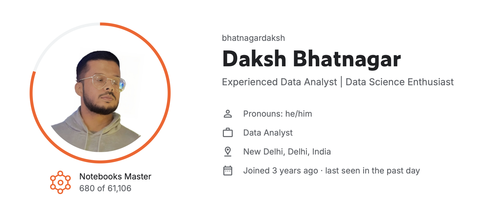

<h1 align="center">🕵🏼 Daksh Bhatnagar</h1>

<h2 align="center">Data Analyst | Reporting Analyst | BI Analyst</h2>

<h3>🔍 About Me</h3>
<ul>
  <li>Hi, My Name is Daksh Bhatnagar. <strong>A Finance Post Graduate and a Data Analyst</strong> with 2 Years Of Experience based out of New Delhi currently working as Technology Associate in ZS Associates, Gurgaon. </li>
   

  <li>I’m passionate about <strong>empowering businesses with data-driven insights</strong> through effective analysis and comprehensive reporting.</li>
   
  <li>My core focus is on <strong>transforming complex data into actionable strategies</strong> that drive decision-making, along with implementing automated solutions that enhance efficiency and cut costs.</li>
   
  <li>With a sound understanding of analytics tools, I’ve dedicated my efforts to <strong>streamlining processes, boosting data accessibility</strong>, and continuously improving operational performance.</li>
</ul>

  💼 <a href="https://dakshbhatnagar.github.io"><strong>Portfolio Website</strong></a>

<h3>🛠️ Skills</h3>
<table style="margin-left: auto; margin-right: auto;">
  <tr>
    <td><strong>Databases:</strong></td>
    <td>MySQL, SQLite3</td>
  </tr>
  <tr>
    <td><strong>Spreadsheets:</strong></td>
    <td>Advanced MS Excel, Advanced Google Sheets</td>
  </tr>

  
  <tr>
    <td><strong>Programming:</strong></td>
    <td><a href="https://github.com/dakshbhatnagar/projects"> Python, Pandas, Numpy, Matplotlib</a> Google AppScript</td>

  </tr>
  <tr>
    <td><strong>BI Tools:</strong></td>
    <td><a href="https://lookerstudio.google.com/reporting/cc4ee68d-2634-4110-8652-811626ea9b05/page/p_4qnx3lohhd">Looker Studio</a>, <a href="https://public.tableau.com/app/profile/daksh.bhatnagar/vizzes">Tableau</a></td>
  </tr>
  <tr>
    <td><strong>Cloud:</strong></td>
    <td>Google Cloud Platform (GCP)</td>
  </tr>
</table>

<h3>🏆 Achievement</h3>

Earned the prestigious notebooks master medal on [Kaggle](https://www.kaggle.com/bhatnagardaksh)

<!-- -->

<h3>👨‍💻 Experience</h3>

In my current role as a Data Analyst, I have:

<ul>
  <li>
    Developed <strong>real-time data pipelines</strong> using Google Sheets, which increased data availability and decision-making efficiency by 20%.
  </li>
  <li>
    Enhanced stakeholder data comprehension by 15% by creating <strong>engaging visualizations</strong> using Looker Studio.
  </li>
  <li>
    Addressed rising subscription costs by identifying inefficiencies after monitoring job portal usage, leading to a <strong>reduction of 68,000 INR per month</strong>, saving the company 816,000 INR annually.
  </li>
  <li>
    Improved operational efficiency and reporting frequency by 30% by <strong>automating reporting processes</strong> using Google AppScript and Python, reducing an hour worth of daily manual work.
  </li>
  <li>
    <strong>Streamlined the appraisal document creation</strong> process by implementing an automated solution using AppScript, ensuring timely and organized document distribution for the team.
  </li>
  <li>
    Reduced 10-12 hours a week worth of workload and improved accuracy in incentive calculations by <strong>automating monthly and quarterly computations</strong> for Recruiters, Team Leaders, and Account Managers using SQL within Python, integrated with the Google Sheets API.
  </li>
  <li>
  <strong>Centralized and updated scattered service agreement data</strong> in Google Sheets, highlighted expired records with Conditional Formatting, and automated follow-up alerts and mail reports using Google AppScript, resulting in 60% improved data accessibility and proactive management.
  </li>
</ul>

<h3>📈 Recent Personal Projects</h3>
<ol>
  <li><strong>Olympics Data Analysis and more using Python:</strong> Find projects on in-depth ARIMA Modelling, Olympics Data Analysis, and more! Check it out <a href="https://github.com/dakshbhatnagar/projects">here</a>.</li>
 

  <li><strong>SQL Projects on HR Data, Restaurant Data, and more:</strong> The <a href="https://github.com/dakshbhatnagar/SQLProjects">repository</a> contains SQL Projects in various industries such as HR, Food, and Data Jobs to uncover valuable insights.</li>
 
  <li><strong>Maximizing Sales Conversions:</strong> A Looker Studio Dashboard that goes in-depth on how a travel company can maximize their Sales Conversion - <a href="https://lookerstudio.google.com/reporting/cc4ee68d-2634-4110-8652-811626ea9b05/page/p_4qnx3lohhd">Link</a>.</li>
 
  <li><strong>Tableau Tales:</strong> Explore insights on COVID-19, Digital Payment Trends in India, and more with Tableau - <a href="https://public.tableau.com/app/profile/daksh.bhatnagar">Take a peek here</a>.</li>
 
  <li><strong>Finding Interesting Insights about Super Store:</strong> Dive deep into the world of retail store analysis done using Google Sheets and Looker Studio - <a href="https://docs.google.com/spreadsheets/d/14h0UCZOhi1nQx7oT7DY8SYmqp3S0Y5UssEjkGAuVgXo/edit#gid=312503756">Check it out here</a>.</li>
</ol>

<h3>📇 Contact Details</h3>

  <strong>🔗 <a href="https://www.linkedin.com/in/dakshb/">LinkedIn</a></strong> 
  📧: <a href="mailto:bhatnagar91@gmail.com">bhatnagar91@gmail.com</a>

<i>

Thanks for stopping by!
</i>
